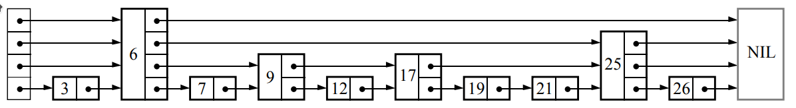

# Algorithm Lab Project

> **Laboratorio per il corso di Algoritmi e Strutture Dati**
> University lab project for the Algorithms and Data Structures course. Implements fundamental algorithms and data structures from scratch in C and Java, without relying on native language collections or external libraries.

---

## Table of Contents

- [Project Overview](#project-overview)
- [Repository Structure](#repository-structure)
- [Prerequisites](#prerequisites)
- [Exercise 1 — Sorting Algorithms (C)](#exercise-1--sorting-algorithms-c)
- [Exercise 2 — Skip List (C)](#exercise-2--skip-list-c)
- [Exercise 3 — Generic Min Heap (Java)](#exercise-3--generic-min-heap-java)
- [Exercise 4 — Graph & Dijkstra's Algorithm (Java)](#exercise-4--graph--dijkstras-algorithm-java)
- [C EXs — Alternative C Implementations](#c-exs--alternative-c-implementations)
- [Code Quality Standards](#code-quality-standards)
- [Original Course Specification](#original-course-specification)

---

## Project Overview

This repository contains four exam exercises for an Algorithms and Data Structures lab course. Each exercise implements a specific algorithm or data structure from scratch:

| Exercise | Language | Topic |
|----------|----------|-------|
| 1 | C | Sorting algorithms (Insertion Sort, Quick Sort variants) |
| 2 | C | Skip List data structure |
| 3 | Java | Generic Min Heap |
| 4 | Java | Directed/Undirected Graph + Dijkstra's shortest path |

The folder `C EXs - Other solutions` contains alternative C implementations for Exercises 1 and 2, each using slightly different architectural approaches.

---

## Repository Structure

```
Algorithm-Lab-Project/
│
├── exercise_1/                      # Sorting Algorithms — C
│   └── src/
│       ├── sort_array.h             # Public API declarations
│       ├── sort_array.c             # Algorithm implementations
│       ├── sort_array_tests.c       # Unit tests (Unity framework)
│       ├── main.c                   # Entry point (reads records.csv)
│       ├── Makefile
│       └── unity.{c,h,internals.h} # Unity testing framework
│
├── exercise_2/                      # Skip List — C
│   ├── skiplist.h                   # Struct definitions & API
│   ├── skiplist.c                   # Skip list implementation
│   ├── Skiplist_test.c              # Unit tests (Unity framework)
│   ├── main.c                       # Entry point (spell-checker demo)
│   ├── Makefile
│   └── unity.{c,h,internals.h}
│
├── exercise_3/                      # Generic Min Heap — Java
│   ├── src/
│   │   ├── MinHeap.java             # Core heap implementation
│   │   ├── MinHeapException.java    # Custom exception
│   │   ├── IntComparator.java       # Integer comparator
│   │   ├── StrComparator.java       # String comparator
│   │   ├── MinHeapMain.java         # Demo entry point
│   │   ├── MinHeapUsage.java        # Usage examples
│   │   ├── MinHeapTests.java        # JUnit test suite
│   │   └── MinHeapTestRunner.java   # Test runner
│   ├── lib/
│   │   ├── junit-4.13.2.jar
│   │   └── hamcrest-core-1.3.jar
│   └── README.md                    # Compilation instructions
│
├── exercise_4/                      # Graph + Dijkstra — Java
│   ├── src/
│   │   ├── Graph.java               # Generic adjacency-list graph
│   │   ├── Edge.java                # Weighted directed edge
│   │   ├── ShortestPathFinder.java  # Dijkstra's algorithm
│   │   ├── DijkastraApp.java        # Entry point
│   │   ├── FileUtils.java           # CSV graph loader
│   │   ├── MinHeap.java             # Min Heap (reused from Ex 3)
│   │   ├── MinHeapException.java
│   │   └── GraphTest.java           # JUnit test suite
│   ├── lib/
│   │   ├── junit-4.13.2.jar
│   │   └── hamcrest-core-1.3.jar
│   └── README.md
│
├── C EXs - Other solutions/         # Alternative C implementations
│   ├── EX1/src/                     # Alternative sorting solution
│   │   ├── structure.{h,c}          # Generic dynamic array wrapper
│   │   ├── sort_lib.{h,c}           # Sorting library
│   │   ├── Main.c                   # Entry point
│   │   ├── Main_test.c              # Unit tests
│   │   └── Makefile
│   ├── EX2/src/                     # Alternative skip list solution
│   │   ├── skiplist.{h,c}           # Extended skip list (+ spell-checker)
│   │   ├── Main.c
│   │   ├── Main_test.c
│   │   └── Makefile
│   └── Resources/C/Unity/           # Shared Unity testing framework
│       └── unity.{c,h,internals.h}
│
├── skiplist.png                     # Skip list visualization
├── Relazione Progetto Algoritmi e Strutture Dati.pdf  # Project report (IT)
├── FAQ.md
├── Git.md
└── UnitTesting.md
```

---

## Prerequisites

### C exercises (1, 2 and C EXs)
- GCC compiler (`gcc`)
- `make`

### Java exercises (3, 4)
- JDK 8 or later (`javac`, `java`)
- JUnit 4.13.2 and Hamcrest 1.3 (pre-bundled in each exercise's `lib/` folder)

---

## Exercise 1 — Sorting Algorithms (C)

**Location:** `exercise_1/src/`

### Description

Generic sorting library implemented in C using `void**` arrays and comparator function pointers, enabling sorting of any data type without language-level generics.

### Algorithms Implemented

| Function | Strategy | Pivot | Average Complexity |
|----------|----------|-------|--------------------|
| `b_insertion_sort` | Binary Insertion Sort | — | O(n²) |
| `quick_sort_Hoares` | Quick Sort — Hoare's partition | First element | O(n log n) |
| `quick_sort_Hoares_r` | Quick Sort — Hoare's partition | Random element | O(n log n) |
| `quick_sort_Lomuto` | Quick Sort — Lomuto partition | Last element | O(n log n) |

#### Binary Insertion Sort
Uses a recursive binary search (`binary_search`) to find the correct insertion position in the already-sorted prefix, reducing the number of comparisons (but not the number of shifts).

#### Quick Sort — Hoare's Partition (fixed pivot)
Pivot is always `base[low]`. Two pointers scan inward; elements are swapped when the invariant is violated.

#### Quick Sort — Hoare's Partition (random pivot)
Same as above but the pivot is chosen at random within `[low, high]` and swapped to position `low` before partitioning. This avoids worst-case O(n²) on already-sorted input.

#### Quick Sort — Lomuto Partition
Pivot is `base[high]`. A single forward scan maintains a boundary `i` between elements `≤ pivot` and `> pivot`.

### API

```c
// sort_array.h

// Binary Insertion Sort — O(n²), stable
void b_insertion_sort(void **base, size_t n_elem, int (*cmpr)(void *, void *));

// Quick Sort, Hoare partition, fixed pivot (first element)
void quick_sort_Hoares(void **base, int low, int high, int (*cmpr)(void *, void *));

// Quick Sort, Hoare partition, random pivot
void quick_sort_Hoares_r(void **base, int low, int high, int (*cmpr)(void *, void *));

// Quick Sort, Lomuto partition, last-element pivot
void quick_sort_Lomuto(void **base, int low, int high, int (*cmpr)(void *, void *));
```

### Build & Run

```bash
cd exercise_1/src

# Build and run unit tests
make test
make runtest

# Build and run main program (reads records.csv)
make main
make runmain          # expects ../records.csv
```

---

## Exercise 2 — Skip List (C)

**Location:** `exercise_2/`

### Description

A probabilistic data structure that allows O(log n) average-case search, insertion, and deletion. The structure maintains multiple "express lanes" on top of a sorted linked list, with each higher level skipping over more elements.



### Data Structures

```c
struct _Node {
    Node    **next;      // Array of forward pointers, one per level
    unsigned int size;   // Height of this node
    void    *item;       // Stored element (generic via void*)
};

struct _Skiplist {
    Node        *head;       // Sentinel head node (MAX_HEIGHT levels)
    unsigned int max_level;  // Current highest non-empty level
    int (*compare)(void *, void *);  // User-supplied comparator
};
```

`MAX_HEIGHT` is set to **30**, giving a maximum of 2³⁰ ≈ 1 billion elements with efficient height distribution.

### API

```c
// skiplist.h

// Create an empty skip list; comparator must return <0, 0, or >0
Skiplist *skipList_create(int (*compare)(void *, void *));

// Insert item into the list in sorted order — O(log n) average
void insertSkiplist(Skiplist *list, void *item);

// Search for item — returns pointer to item or NULL — O(log n) average
void *searchSkipList(Skiplist *list, void *item);

// Free all allocated memory
void skiplist_free(Skiplist *list);
```

### Level Generation

Each new node is assigned a height by repeatedly flipping a coin (50 % probability) until tails, up to `MAX_HEIGHT`. This gives a geometric distribution that ensures the expected number of nodes at each level halves as the level increases.

### Build & Run

```bash
cd exercise_2

# Build and run unit tests
make test
make runtest

# Build and run main program (spell-checker demo)
make main
make runmain          # expects dictionary.txt and correctme.txt
```

---

## Exercise 3 — Generic Min Heap (Java)

**Location:** `exercise_3/src/`

### Description

A generic minimum heap backed by a resizable array. The heap accepts any type `T` along with a `Comparator<? super T>` so that the ordering strategy is fully decoupled from the data type.

### Key Class: `MinHeap<T>`

```java
public class MinHeap<T> {
    MinHeap(int capacity, Comparator<? super T> comparator)

    void insert(T element)              // Add element; trickle up — O(log n)
    T    extract_min()                  // Remove & return minimum — O(log n)
    void decrease_element(int i, T val) // Decrease key at index i — O(log n)
    int  size()                         // Current number of elements
    boolean is_empty()
}
```

The array doubles in capacity automatically when full (`grow()`).

### Heap Operations

| Operation | Implementation | Complexity |
|-----------|---------------|------------|
| `insert` | Append + `trickle_up` | O(log n) |
| `extract_min` | Swap root with last + `trickle_down` | O(log n) |
| `decrease_element` | Replace + `trickle_up` | O(log n) |
| Index navigation | `parent = (i-1)/2`, `left = 2i+1`, `right = 2i+2` | O(1) |

### Comparators Provided

| Class | Compares |
|-------|---------|
| `IntComparator` | `Integer` values |
| `StrComparator` | `String` values (lexicographic) |

### Build & Run

Navigate to `exercise_3/src/` first.

**Linux / macOS**
```bash
# Compile all sources
javac -cp '.:../lib/junit-4.13.2.jar:../lib/hamcrest-core-1.3.jar' *.java

# Run unit tests
java -cp '.:../lib/junit-4.13.2.jar:../lib/hamcrest-core-1.3.jar' MinHeapTestRunner

# Run demo
java -cp '.' MinHeapMain
```

**Windows** (replace `:` with `;`)
```bat
javac -cp ".;..\lib\junit-4.13.2.jar;..\lib\hamcrest-core-1.3.jar" MinHeapTestRunner.java
java  -cp ".;..\lib\junit-4.13.2.jar;..\lib\hamcrest-core-1.3.jar" MinHeapTestRunner
```

---

## Exercise 4 — Graph & Dijkstra's Algorithm (Java)

**Location:** `exercise_4/src/`

### Description

A generic weighted graph implemented with an adjacency list, paired with Dijkstra's shortest-path algorithm that uses the `MinHeap` from Exercise 3 as its priority queue.

### Components

#### `Graph<L, E>` — Generic Adjacency-List Graph

```java
// L = vertex label type, E = edge weight type
// Both must implement Comparable<L> / Comparable<E>
Graph(boolean isOriented)          // directed or undirected graph

void   addVertex(L v)
void   addEdge(Edge<L, E> e)
void   removeVertex(L v)
void   removeEdge(Edge<L, E> e)
Set<L> getVertices()
List<Edge<L,E>> getAdjVerticesOf(L v)
E      getEdgeWeight(L v1, L v2)
boolean containsVertex(L v)
boolean containsEdge(Edge<L,E> e)
int    numVertices()
int    numEdges()
```

Internal storage: `Map<L, LinkedList<Edge<L,E>>> adjList`.  
For undirected graphs `addEdge` inserts both directions automatically.

#### `Edge<T, K>` — Weighted Directed Edge

```java
Edge(T vertex1, T vertex2, K weight)
T getVertex1()
T getVertex2()
K getWeight()
int compareTo(Edge<T,K> other)  // compares by weight
```

#### `ShortestPathFinder<L>` — Dijkstra's Algorithm

```java
ShortestPathFinder(Graph<L, Double> graph)

void dijkstra(L source)   // Run algorithm from 'source'
void printSolution()      // Print distances to all vertices
void printPath(L dest)    // Print shortest path to 'dest'
```

**Algorithm outline:**
1. Initialise `dist[v] = ∞` for all `v`; `dist[source] = 0`.
2. Insert all vertices into a `MinHeap` keyed by distance.
3. While the heap is non-empty:
   - Extract vertex `u` with minimum distance.
   - For each neighbour `v` of `u`, **relax** the edge `(u, v)`:
     - If `dist[u] + w(u,v) < dist[v]`, update `dist[v]`, update parent `π[v] = u`, and call `decrease_element` on the heap.
4. Time complexity: **O((V + E) log V)** with a binary heap.

#### `FileUtils` — CSV Graph Loader

```java
static void GraphCSV(Graph<String, Double> g, String path)
```

Reads a CSV file where each line is `city1,city2,distance_km` and populates the graph. Used with the Italian city distance dataset (`italian_dist_graph.csv`).

#### `DijkastraApp` — Entry Point

```java
Graph<String, Double> g = new Graph<>(false);   // undirected
FileUtils.GraphCSV(g, "../italian_dist_graph.csv");
ShortestPathFinder<String> sp = new ShortestPathFinder<>(g);
sp.dijkstra("torino");
sp.printSolution();
```

### Build & Run

Navigate to `exercise_4/src/` first.

**Linux / macOS**
```bash
javac -cp '.:../lib/junit-4.13.2.jar:../lib/hamcrest-core-1.3.jar' *.java

# Run tests
java -cp '.:../lib/junit-4.13.2.jar:../lib/hamcrest-core-1.3.jar' GraphTest

# Run application (requires italian_dist_graph.csv one level up)
java -cp '.' DijkastraApp
```

**Windows**
```bat
javac -cp ".;..\lib\junit-4.13.2.jar;..\lib\hamcrest-core-1.3.jar" .\GraphTest.java
java  -cp ".;..\lib\junit-4.13.2.jar;..\lib\hamcrest-core-1.3.jar" GraphTest
```

---

## C EXs — Alternative C Implementations

**Location:** `C EXs - Other solutions/`

This folder contains alternative C implementations of Exercises 1 and 2. They share the same algorithmic goals but adopt a different code architecture.

### EX1 — Alternative Sorting Implementation

**Location:** `C EXs - Other solutions/EX1/src/`

Key difference from `exercise_1`: sorting operates on a **`Structure`** wrapper type — a generic dynamic array — rather than a raw `void**` pointer, providing a more object-oriented interface.

#### `structure.{h,c}` — Generic Dynamic Array

```c
typedef struct { void **data; int size; int capacity; } Structure;

Structure *structureNew(int capacity);
void  structureInsert(Structure *s, void *item);
void  structureDelete(Structure *s, int index);
void *structureGet(Structure *s, int index);
```

#### `sort_lib.{h,c}` — Sorting on `Structure`

Sorting functions take a `Structure*` instead of `void**`, keeping the container and algorithm cleanly separated.

Also includes `readFile()` for loading records from a CSV file directly into a `Structure`.

**Record type:**
```c
typedef struct {
    int   id;
    char *field1;
    int   field2;
    float field3;
} Record;
```

#### Build & Run

```bash
cd "C EXs - Other solutions/EX1/src"

make test && make runtest   # unit tests
make main && make runmain   # main program (reads ./dataset/records.csv)
```

---

### EX2 — Alternative Skip List Implementation

**Location:** `C EXs - Other solutions/EX2/src/`

An extended version of the skip list that adds file-loading helpers and a practical **spell-checker** application.

#### Additional Functions vs. Exercise 2

| Function | Description |
|----------|-------------|
| `newSkipList` | Alias for `skipList_create` |
| `deleteSkipList` | Full memory deallocation |
| `readFile1` | Load a word list from a text file into the skip list |
| `checkPhrase` | Check each word of a phrase against the skip list dictionary |
| `compareField1/2/3` | Comparators for string / int / float record fields |

#### Spell-Checker Application

```
main <dictionary_file> <phrase_file>
```

1. Loads `dictionary_file` into the skip list (O(n log n)).
2. Reads each word from `phrase_file`.
3. Looks up every word (O(log n)); prints words not found in the dictionary.

#### Build & Run

```bash
cd "C EXs - Other solutions/EX2/src"

make test && make runtest   # unit tests
make main && make runmain   # main program (reads dataset/dictionary.txt & correctme.txt)
```

#### Shared Testing Framework

Both alternative exercises use the **Unity** C testing framework located in:
```
C EXs - Other solutions/Resources/C/Unity/
```

---

## Code Quality Standards

The following conventions apply to all source code in this repository:

- **Indentation:** 2 spaces, no tabs
- **Language:** English for all identifiers, comments, and documentation
- **Naming:**
  - Java: `camelCase` for methods/variables, `PascalCase` for classes
  - C: `snake_case` for functions and variables, `UPPER_SNAKE_CASE` for constants/macros
- **Function length:** maximum 30 lines per function/method
- **Comments:** explain *why*, not *what*; avoid redundant comments
- **No external data structures:** all required data structures are implemented from scratch; native collections (e.g., `java.util.PriorityQueue`, `qsort`) are not used where their manual implementation is the exercise goal
- **Git hygiene:** frequent, atomic commits; no binary or data files committed

---

## Original Course Specification

# Laboratorio per il corso di Algoritmi e Strutture Dati: regole d'esame, indicazioni generali e suggerimenti, consegne per gli esercizi

# Regole d'esame

---

**Importante**: gli studenti che hanno nel piano di studi l'insegnamento di Algoritmi con un numero di CFU **differente da 9** sono pregati di contattare il docente al più presto, al fine di concordare un programma d'esame commisurato ai CFU.

---

Il progetto di laboratorio può essere svolto individualmente o in gruppo (al più 3 persone). **I membri di uno stesso gruppo devono appartenere tutti allo stesso turno di laboratorio**.

ll progetto di laboratorio va consegnato mediante Git (vedi sotto) entro e non oltre la data della prova scritta che si intende sostenere. E' vietato sostenere la prova scritta in caso di mancata consegna del progetto di laboratorio. In caso di superamento della prova scritta, la prova orale (discussione del laboratorio) va sostenuta, previa prenotazione mediante apposita procedura che sarà messa a disposizione sulla pagina i-learn del corso, **nella medesima sessione della prova scritta superata** (si ricorda che le sessioni sono giugno-luglio 2022, settembre 2022, dicembre 2022 e gennaio-febbraio 2023).

Si noti che, per la sola sessione di giugno-luglio saranno previsti due appelli e, pertanto, esisteranno due possibilità per la discussione del laboratorio (primo o secondo appello della sessione). Nelle altre sessioni, l'appello è unico. Ad esempio, se la studentessa/lo studente X supera la prova scritta a dicembre 2022, deve necessariamente sostenere la discussione di laboratorio con la prova orale di dicembre 2022 (non sarà possibile discutere a gennaio-febbraio 2023).

Esempio:

- la studentessa/lo studente X sostiene la prova scritta nel primo appello di giugno;
- la studentessa/lo studente X deve assicurarsi che il progetto su GitLab, alla data della prova scritta che intende sostenere (in questo esempio, quella del primo appello di giugno), sia aggiornato alla versione che vuole presentare al docente di laboratorio;
- se la studentessa/lo studente X supera la prova scritta nel primo appello di giugno, deve (pena la perdita del voto ottenuto nella prova scritta) iscriversi a uno degli appelli orali di giugno o luglio, prenotarsi su i-learn in uno degli slot messi a disposizione dal docente del turno di appartenenza e sostenere l'orale nello slot temporale prenotato.

Le regole riportate sopra si applicano alla singola studentessa/al singolo studente. Per poter accedere alla discussione di laboratorio è in ogni caso necessaria l'iscrizione alla prova orale corrispondente su myunito.

Studentesse/studenti diversi, appartenenti allo stesso gruppo, possono sostenere la prova **scritta** nello stesso appello o in appelli diversi. Se studentesse/studenti diversi, appartenenti allo stesso gruppo, superano la prova scritta nello stesso appello, **devono** sostenere l' **orale** nello stesso appello orale. Se studentesse/studenti diversi, appartenenti allo stesso gruppo, superano la prova scritta in appelli diversi, **possono** sostenere l'**orale** in appelli diversi.

Ad esempio, si consideri un gruppo di laboratorio costituito dalle studentesse/dagli studenti X, Y e Z, e si supponga che i soli X e Y sostengano la prova scritta nel primo appello di giugno, X con successo, mentre Y con esito insufficiente. Devono essere rispettate le seguenti condizioni:

- alla data della prova scritta del primo appello di giugno, il progetto di laboratorio del gruppo deve essere aggiornato alla versione che si intende presentare;
- il solo studente X deve sostenere la prova orale nella sessione giugno-luglio,  procedendo come indicato nell'esempio riportato sopra, mentre Y e Z sosterranno la discussione quando avranno superato la prova scritta.
- Supponiamo che Y e Z superino la prova scritta nell'appello di gennaio: essi dovranno sostenere la prova orale nella sessione di gennaio-febbraio.
- Gli studenti Y e Z dovranno, di norma, discutere la stessa versione del progetto di laboratorio che ha discusso lo studente X; i.e., eventuali modifiche al laboratorio successive alla discussione di X dovranno essere debitamente documentate (i.e., il log delle modifiche dovrà comparire su GitLab) e motivate.

**Validità del progetto di laboratorio** : le specifiche per il progetto di laboratorio descritte in questo documento resteranno valide fino all'ultimo appello della sessione gennaio-febbraio relativa al corrente anno accademico **(vale a dire, quella di gennaio-febbraio 2023)** e non oltre! Gli appelli delle sessioni successive a questa dovranno essere sostenuti sulla base delle specifiche che verranno descritte nella prossima edizione del laboratorio di algoritmi.


# Indicazioni generali e suggerimenti

## Uso di Git

Durante la scrittura del codice è richiesto di usare in modo appropriato il sistema di versioning Git. Questa richiesta implica quanto segue:

- il progetto di laboratorio va inizializzato "clonando" il repository del laboratorio come descritto nel file Git.md;
- come è prassi nei moderni ambienti di sviluppo, è richiesto di effettuare commit frequenti. L'ideale è un commit per ogni blocco di lavoro terminato (es. creazione e test di una nuova funzione, soluzione di un baco, creazione di una nuova interfaccia, ...);
- ogni membro del gruppo dovrebbe effettuare il commit delle modifiche che lo hanno visto come principale sviluppatore;
- al termine del lavoro si dovrà consegnare l'intero repository.

Il file Git.md contiene un esempio di come usare Git per lo sviluppo degli esercizi proposti per questo laboratorio.

---

**Nota importante**: Su git dovrà essere caricato solamente il codice sorgente, in particolare nessun file dati dovrà essere oggetto di commit!

---

Si rammenta che la valutazione del progetto di laboratorio considererà anche l'uso adeguato di git da parte di ciascun membro del gruppo.

## Linguaggio in cui sviluppare il laboratorio

Gli esercizi vanno implementati utilizzando il linguaggio C o Java come precisato di seguito:

- Esercizio 1: C
- Esercizio 2: C
- Esercizio 3: Java
- Esercizio 4: Java

Come indicato sotto, alcuni esercizi chiedono di implementare codice generico. Seguono alcuni suggerimenti sul modo di realizzare codice con questa caratteristica nei due linguaggi accettati.

**Nota** : Con "codice generico" si intende codice che deve poter essere eseguito con tipi di dato non noti a tempo di compilazione.

**Suggerimenti (C)**: Nel caso del C, è necessario capire come meglio approssimare l'idea di codice generico utilizzando quanto permesso dal linguaggio. Un approccio comune è far sì che le funzioni e le procedure presenti nel codice prendano in input puntatori a `void` e utilizzino qualche funzione fornita dall'utente per accedere alle componenti necessarie.

Nota: chi è in grado di realizzare tipi di dato astratto tramite tipi opachi è incoraggiato a procedere in questa direzione.

**Suggerimenti (Java)**: Sebbene in Java la soluzione più in linea con il moderno utilizzo del linguaggio richiederebbe la creazione di classi parametriche, tutte le scelte implementative (compresa la decisione di usare o meno classi parametriche) sono lasciate agli studenti. Inoltre, è possibile (e consigliato) usare gli ArrayList invece degli array nativi al fine di semplificare la realizzazione di codice generico.

## Uso di librerie esterne e/o native del linguaggio scelto

È vietato (sia nello sviluppo in Java che in quello in C) l'uso di strutture dati native del linguaggio scelto o offerte da librerie esterne, quando la loro realizzazione è richiesta da uno degli esercizi proposti.

È, invece, possibile l'uso di strutture dati native del linguaggio o offerte da librerie esterne, se la loro realizzazione non è richiesta da uno degli esercizi proposti.

Es.: nello sviluppo in Java, l'uso di ArrayList è da ritenersi possibile, se nessun esercizio chiede la realizzazione in Java di un array dinamico.

## Qualità dell'implementazione

È parte del mandato degli esercizi la realizzazione di codice di buona qualità.

Per "buona qualità" intendiamo codice ben modularizzato, ben commentato e ben testato.

**Alcuni suggerimenti:**

- verificare che il codice sia suddiviso correttamente in package o moduli;
- aggiungere un commento, prima di una definizione, che spiega il funzionamento dell'oggetto definito. Evitare quando possibile di commentare direttamente il codice interno alle funzioni/metodi implementati (se il codice è ben scritto, i commenti in genere non servono);
- la lunghezza di un metodo/funzione è in genere un campanello di allarme: se essa cresce troppo, probabilmente è necessario rifattorizzare il codice spezzando la funzione in più parti. In linea di massima si può consigliare di intervenire quando la funzione cresce sopra le 30 righe (considerando anche commenti e spazi bianchi);
- sono accettabili commenti in italiano, sebbene siano preferibili in inglese;
- tutti i nomi (es., nomi di variabili, di metodi, di classi, ecc.) *devono* essere significativi e in inglese;
- il codice deve essere correttamente indentato; impostare l'indentazione a 2 caratteri (un'indentazione di 4 caratteri è ammessa ma scoraggiata) e impostare l'editor in modo che inserisca "soft tabs" (cioè, deve inserire il numero corretto di spazi invece che un carattere di tabulazione);
- per dare i nomi agli identificatori, seguire le convenzioni in uso per il linguaggio scelto:
  - Java: i nomi dei package sono tutti in minuscolo senza separazione fra le parole (es. thepackage); i nomi dei tipi (classi, interfacce, ecc.) iniziano con una lettera maiuscola e proseguono in camel case (es. TheClass), i nomi dei metodi e delle variabili iniziano con una lettera minuscola e proseguono in camel case (es. theMethod), i nomi delle costanti sono tutti in maiuscolo e in formato snake case (es. THE\_CONSTANT);
  - C:  macro e costanti sono tutti in maiuscolo e in formato snake case (es. THE\_MACRO, THE\_CONSTANT); i nomi di tipo (e.g.  struct, typedefs, enums, ...) iniziano con una lettera maiuscola e proseguono in camel case (e.g., TheType, TheStruct); i nomi di funzione iniziano con una lettera minuscola e proseguono in snake case (e.g., the\_function());
- i file vanno salvati in formato UTF-8.

# Consegne per gli esercizi

**Nota** : la presente sezione contiene alcune formule descritte usando la sintassi \LaTeX. È possibile convertire l'intero documento in formato pdf - di più facile lettura - usando l'utility pandoc. Da riga di comando (Unix):

pandoc README.md -o README.pdf

---

**Importante**: Gli esercizi richiedono (fra le altre cose) di sviluppare codice generico. Nello sviluppare questa parte, si deve assumere di stare sviluppando una libreria generica intesa come fondamento di futuri programmi. Non è pertanto lecito fare assunzioni semplificative; in generale, l'implementazione della libreria generica deve restare separata e non deve essere influenzata in alcun modo dagli usi di essa eventualmente richiesti negli esercizi (ad esempio, se un esercizio dovesse richiedere l'implementazione della struttura dati grafo e quello stesso o un altro esercizio dovesse richiedere l'implementazione, a partire da tale struttura dati, di un algoritmo per il calcolo delle componenti connesse di un grafo, l'implementazione della struttura dati dovrebbe essere separata dall'algoritmo per il calcolo delle componenti connesse e *non* dovrebbe contenere elementi – variabili, procedure, funzioni, metodi, ecc. – eventualmente utili a tale algoritmo, ma non essenziali alla struttura dati; analogamente, se un esercizio dovesse richiedere di operare su grafi con nodi di tipo stringa, l'implementazione della struttura dati grafo dovrebbe restare generica e non potrebbe quindi assumere per i nodi il solo tipo stringa).

---

In sede di discussione d'esame, sarà facoltà del docente chiedere di eseguire gli algoritmi implementati su dati forniti dal docente stesso. Nel caso questi dati siano memorizzati su file, questi saranno dei csv con la medesima struttura dei dataset forniti e descritti nel testo dell'esercizio. I codici sviluppati dovranno consentire un rapido e semplice adattamento agli input forniti: ad esempio, **una buona implementazione consentirà di inserire in input il nome del file su cui eseguire il test**, mentre una peggiore richiederà di modificare il codice sorgente e una successiva compilazione a fronte della sola modifica del nome del file contenente il dataset.

## Unit Testing

Come indicato esplicitamente nei testi degli esercizi, il progetto di laboratorio comprende anche la definizione di opportune suite di unit test.

Si rammenta, però, che il focus del laboratorio è l'implementazione di strutture dati e algoritmi. Relativamente agli unit-test sarà quindi sufficiente che gli studenti dimostrino di averne colto il senso e di saper realizzare una suite di test sufficiente a coprire i casi più comuni e i casi limite.

## Esercizio 1

### Linguaggio richiesto: C

### Testo

Implementare una libreria che offre due algoritmi di ordinamento `Quick Sort` e `Binary Insertion Sort`. Con `Binary Insertion Sort` ci riferiamo a una versione dell'algoritmo `Insertion Sort` in cui la posizione all'interno della sezione ordinata del vettore in cui inserire l'elemento corrente è determinata tramite ricerca binaria. Nell'implementazione del `Quick Sort`, la scelta del `pivot` dovrà essere studiato e discusso nella relazione.

Il codice che implementa `Quick Sort` e `Binary Insertion Sort` deve essere generico. Inoltre, la libreria deve permettere di specificare (cioè deve accettare in input) il criterio secondo cui ordinare i dati.

### Unit Testing

Implementare gli unit-test per la libreria secondo le indicazioni suggerite nel documento Unit Testing.

### Uso della libreria di ordinamento implementata

Il file `records.csv` che potete trovare (compresso) all'indirizzo

```
https://datacloud.di.unito.it/index.php/s/X7qC8JSLNRtLxPC
```

contiene 20 milioni di record da ordinare.
Ogni record è descritto su una riga e contiene i seguenti campi:

- id: (tipo intero) identificatore univoco del record;
- field1: (tipo stringa) contiene parole estratte dalla divina commedia,
  potete assumere che i valori non contengano spazi o virgole;
- field2: (tipo intero);
- field3: (tipo floating point);

Il formato è un CSV standard: i campi sono separati da virgole; i record sono
separati da `\n`.

Usando gli algoritmi `Quick Sort` e `Binary Insertion Sort` implementati, si ordinino i *record* (non è sufficiente ordinare i
singoli campi) contenuti nel file `records.csv` in ordine non decrescente secondo i valori contenuti nei tre campi "field" (pertanto, è necessario ripetere l'ordinamento tre volte, una volta per ciascun campo).

Si misurino i tempi di risposta variando il criterio di scelta del `pivot` nel `Quick Sort` e si produca una breve relazione in cui si riportano i risultati ottenuti insieme a un loro commento. Nel caso l'ordinamento si protragga per più di 10 minuti potete interrompere l'esecuzione e riportare un fallimento dell'operazione.

I risultati sono quelli che vi sareste aspettati? Se sì, perché? Se no, fate delle ipotesi circa il motivo per cui gli algoritmi non funzionano come vi aspettate, un algoritmo offre delle prestazioni migliori dell'altro, la scelta del `pivot` influenza le prestazioni di `Quick Sort`. Verificatele e riportate quanto scoperto nella relazione.

**Si ricorda che** che il file `records.csv` **NON DEVE ESSERE OGGETTO DI COMMIT SU GIT!**

## Esercizio 2 - Skip List

### Linguaggio richiesto: C

### Testo

Realizzare una struttura dati chiamata `skip_list`. La `skip_list` è un tipo di lista concatenata che memorizza una *lista ordinata* di elementi.

Al contrario delle liste concatenate classiche, la `skip_list` è una struttura dati probabilistica che permette di realizzare l'operazione di ricerca con complessità `O(log n)` in termini di tempo. Anche le operazioni di inserimento e cancellazione di elementi possono essere realizzate in tempo `O(log n)`. Per questa ragione, la `skip_list` è una delle strutture dati che vengono spesso utilizzate per indicizzare dati.

Ogni nodo di una lista concatenata contiene un puntatore all'elemento successivo nella lista. Dobbiamo quindi scorrere la lista sequenzialmente per trovare un elemento nella lista. La `skip_list` velocizza l'operazione di ricerca creando delle "vie espresse" che permettono di saltare parte della lista durante l'operazione di ricerca. Questo è possibile perché ogni nodo della `skip_list` contiene non solo un singolo puntatore al prossimo elemento della lista, ma un array di puntatori che ci permettono di saltare a diversi punti seguenti nella lista. Un esempio di questo schema è rappresentato nella seguente figura:


Si implementi quindi una libreria che realizza la struttura dati `skip_list`. L'implementazione deve essere generica per quanto riguarda il tipo dei dati memorizzati nella struttura. Come suggerimento, una possibile definizione del tipo di dati `skip_list` è la seguente:

```
#define MAX_HEIGHT ....

typedef struct _SkipList SkipList;
typedef struct _Node Node;

struct _SkipList {
  Node *head;
  unsigned int max_level;
  int (*compare)(void*, void*);
};

struct _Node {
  Node **next;
  unsigned int size;
  void *item;
};
```

Dove:

- `MAX_HEIGHT`: è una costante che definisce il massimo numero di puntatori che possono esserci in un singolo nodo della `skip_list`. Come si vede nella figura, ogni nodo può avere un numero distinto di puntatori.

- `unsigned int size`: è il numero di puntatori in un dato nodo della `skip_list`.

- `unsigned int max_level`: determina il massimo attuale tra i vari `size`.

La libreria deve includere le due operazioni elencate sotto, che sono riportate in pseudo-codice. Tradurre lo pseudo-codice in C.

##### insertSkipList: Inserisce I nella skiplist ``list``
```
insertSkipList(list, I)

    new = createNode(I, randomLevel())
    if new->size > list->max_level
        list->max_level = new->size

    x = list->head
    for k = list->max_level downto 1 do
        if (x->next[k] == NULL || I < x->next[k]->item)
            if k < new->size {
              new->next[k] = x->next[k]
              x->next[k] = new
            }
        else
            x = x->next[k]
```

La funzione ``randomLevel()`` determina il numero di puntatori da includere nel nuovo nodo e deve essere realizzata conformemente al seguente algoritmo. Spiegare il vantaggio di questo algoritmo nella relazione da consegnare con l'esercizio:
```
randomLevel()
    lvl = 1

    // random() returns a random value in [0...1)
    while random() < 0.5 and lvl < MAX_HEIGHT do
        lvl = lvl + 1
    return lvl
```

#####  searchSkipList: Verifica se I è presente nella skiplist list
```
searchSkipList(list, I)
    x = list->head

    // loop invariant: x->item < I
    for i = list->max_level downto 1 do
        while x->next[i]->item < I do
            x = x->next[i]

    // x->item < I <= x->next[1]->item
    x = x->next[1]
    if x->item == item then
        return x->item
    else
        return failure
```


La libreria deve anche includere delle funzioni che permettono di creare una `skip_list` vuota e cancellare completamente una `skip_list` esistente. Quest'ultima operazione, in particolare, deve liberare correttamente tutta la memoria allocata per la `skip_list`.


### Unit Testing

Implementare gli unit-test per tutte le operazioni della `skip_list` secondo le indicazioni suggerite nel documento Unit Testing.

### Uso delle funzioni implementate

All'indirizzo

```
https://datacloud.di.unito.it/index.php/s/taii8aA8rNnXgCN
```
potete trovare un dizionario (`dictionary.txt`) e un file da correggere (`correctme.txt`).

Il dizionario contiene un elenco di parole. Le parole sono scritte di seguito, ciascuna su una riga.

Il file `correctme.txt` contiene un testo da correggere. Alcune parole in questo testo non ci sono nel dizionario.

Si implementi una applicazione che usa la struttura dati ``skip_list`` per determinare in maniera efficiente la lista di parole nel testo da correggere non presenti nel dizionario dato come input al programma.

Si sperimenti il funzionamento dell'applicazione considerando diversi valori per la constante ``MAX_HEIGHT``, riportando in una breve relazione (circa una pagina) i risultati degli esperimenti.

**Si ricorda** che il dizionario e `correctme.txt` **NON DEVONO ESSERE OGGETTO DI COMMIT SU GIT!**

### Condizioni per la consegna:

-- Creare una sottocartella chiamata ``ex2`` all'interno del repository.

-- La consegna deve obbligatoriamente contenere un `Makefile`. Il `Makefile` deve produrre all'interno di ``ex2/build`` un file eseguibile chiamato ``main_ex2``.

-- ``main_ex2`` deve ricevere come parametri il path del dizionario da usare come riferimento e il file da correggere, necessariamente in quest'ordine. Il risultato va stampato a schermo, con le parole ordinate come nel file da correggere. Per esempio:

```
$ ./main_ex2 /tmp/data/dictionary.txt /tmp/data/correctme.txt 
cinqve
perpeteva
squola
domandrono
vuolessi
scrissi
corpito
wita
```

## Esercizio 3

### Linguaggio richiesto: Java

### Testo

Si implementi una libreria che realizza la struttura dati Heap Minimo. La struttura dati deve:
- rappresentare internamente lo heap tramite un vettore (è possibile usare anche altre strutture interne di supporto, se necessarie);
- consentire un numero qualunque e non noto a priori di elementi dello heap;
- essere generica per quanto riguarda il tipo degli elementi dello heap;
- essere generica per quanto riguarda il criterio di confronto fra elementi dello heap.

Essa deve, inoltre, offrire (almeno) le seguenti operazioni (accanto a ogni operazione è specificata la
complessità richiesta, in cui n indica il numero di elementi dello heap):
- creazione di uno heap minimo vuoto - O(1);
- inserimento di un elemento - O(log n);
- restituzione della dimensione dello heap - O(1);
- restituzione del genitore di un elemento - O(1);
- restituzione del figlio sinistro di un elemento - O(1);
- restituzione del figlio destro di un elemento - O(1);
- estrazione dell'elemento con valore minimo - O(log n);
- diminuzione del valore di un elemento - O(log n).

Una descrizione della struttura dati Heap è riportata sui lucidi e le dispense fornite nella parte di teoria del corso,
 nonché sul testo Cormen et al, `Introduzione agli algoritmi e strutture dati`, McGraw-Hill, Terza edizione, 2010, nel capitolo `Heapsort`. In particolare, si suggerisce il riferimento al testo per tutti quegli aspetti non esplicitamente trattati a lezione.

### Unit Testing

Implementare gli unit-test per la libreria secondo le indicazioni suggerite nel documento Unit Testing.

## Esercizio 4

### Linguaggio richiesto: Java

### Testo

Si implementi una libreria che realizza la struttura dati Grafo in modo che **sia ottimale per dati sparsi**
(IMPORTANTE: le scelte implementative che farete dovranno essere giustificate in relazione alle nozioni presentate
durante le lezioni in aula). La struttura deve consentire di rappresentare sia grafi diretti che grafi non diretti
(suggerimento:  un grafo non diretto può essere rappresentato usando un'implementazione per grafi diretti modificata
per garantire che, per ogni arco (a,b), etichettato w, presente nel grafo, sia presente nel grafo anche l'arco (b,a),
etichettato w. Ovviamente, il grafo dovrà mantenere l'informazione che specifica se esso è un grafo diretto o non diretto.).

L'implementazione deve essere generica sia per quanto riguarda il tipo dei nodi, sia per quanto riguarda le etichette
degli archi.

La struttura dati implementata dovrà offrire (almeno) le seguenti operazioni (accanto a ogni operazione è specificata la
complessità richiesta; n può indicare il numero di nodi o il numero di archi, a seconda del contesto):

- Creazione di un grafo vuoto – O(1)
- Aggiunta di un nodo – O(1)
- Aggiunta di un arco – O(1)
- Verifica se il grafo è diretto – O(1)
- Verifica se il grafo contiene un dato nodo – O(1)
- Verifica se il grafo contiene un dato arco – O(1)  (*)
- Cancellazione di un nodo – O(n)
- Cancellazione di un arco – O(1)  (*)
- Determinazione del numero di nodi – O(1)
- Determinazione del numero di archi – O(n)
- Recupero dei nodi del grafo – O(n)
- Recupero degli archi del grafo – O(n)
- Recupero nodi adiacenti di un dato nodo – O(1)  (*)
- Recupero etichetta associata a una coppia di nodi – O(1) (*)

(*) quando il grafo è veramente sparso, assumendo che l'operazione venga effettuata su un nodo la cui lista di adiacenza ha una lunghezza in O(1).

### Unit Testing

Implementare gli unit-test per la libreria secondo le indicazioni suggerite nel documento Unit Testing.

### Uso delle librerie che implementano la struttura dati Grafo e la struttura dati Heap

Si implementi l'algoritmo di Dijkstra per determinare i cammini minimi da sorgente unica in un grafo orientato pesato, con pesi degli archi tutti non negativi.

L'implementazione dell'algoritmo di Dijkstra dovrà operare su un grafo realizzato tramite la libreria implementata secondo le specifiche fornite sopra e dovrà inoltre utilizzare al proprio interno una coda di priorità minima rappresentata con un heap realizzato con la libreria implementata secondo le specifiche dell'Esercizio 3.


### Uso della libreria che implementa la struttura dati Grafo e dell'algoritmo di Dijkstra

Si scriva un'applicazione che utilizza l'algoritmo di Dijkstra implementato per determinare i cammini minimi dalla città di Torino sul grafo descritto nel file italian\_dist\_graph.csv che potete trovare (compresso) all'indirizzo

```
https://datacloud.di.unito.it/index.php/s/PirTJpq4JMnpH3G
```

Tale file contiene le distanze in metri tra alcune località
italiane e una frazione delle località a loro più vicine.
Il formato è un CSV standard: i campi sono separati da virgole; i record sono separati dal carattere di fine
riga (\\n).

Ogni record contiene i seguenti dati:

- località 1: (tipo stringa) nome della località "sorgente". La stringa può contenere spazi, non può contenere virgole;
- località 2: (tipo stringa) nome della località "destinazione". La stringa  può contenere spazi, non può contenere virgole;
- distanza: (tipo float) distanza in metri tra le due località.

**Note** :

- potete interpretare le informazioni presenti nelle righe del file come   archi non diretti (pertanto, si suggerisce di inserire nel grafo sia l'arco di andata che quello di ritorno a fronte di ogni riga letta).
- il file è stato creato a partire da un dataset poco accurato. I dati riportati contengono inesattezze e imprecisioni.

**Si ricorda** il file italian\_dist\_graph.csv **NON DEVE ESSERE OGGETTO DI COMMIT SU GIT!**

**Controlli**

Un'implementazione corretta dell'algoritmo di Dijkstra, eseguita sui dati
contenuti nel file italian\_dist\_graph.csv, dovrebbe determinare un cammino
minimo tra "torino" e "catania" lungo ~1207.68 Km.
